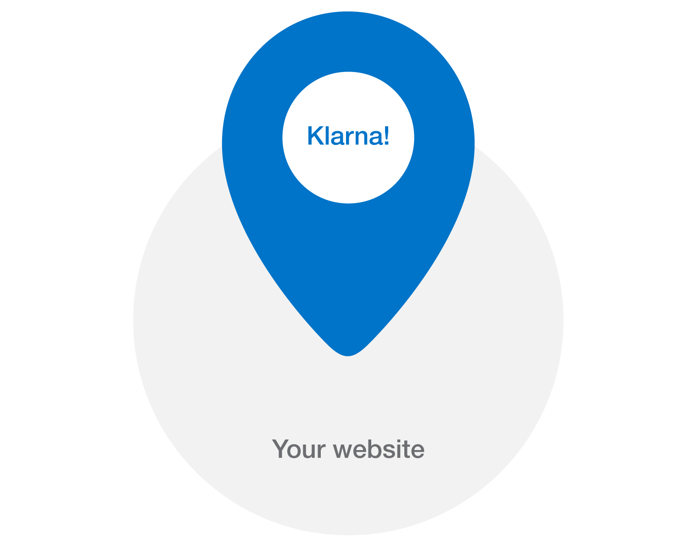

# Klarna on Demand for Digital Goods

Klarna on-demand for digital goods is a payment solution aimed at virtual goods such as articles, downloadable software, music, videos and more. Best of all, setting this up directly in your website is amazingly simple.

## How does this work?
A solution can't really be good if you do not trust and understand it. Have a look at our [process overview](process_overview.md) to see how we make the magic happen.

## Using the service
Have a look at the [integration guide](integration.md) for full details on how to use Klarna on-demand for digital goods in your site.

## Sample implementation
If integration guides aren't your thing, or if you need to see how our offering works in practice, you can go have a look at our [sample site project](https://github.com/klarna/sample-digital-goods-backend/tree/facelift).
