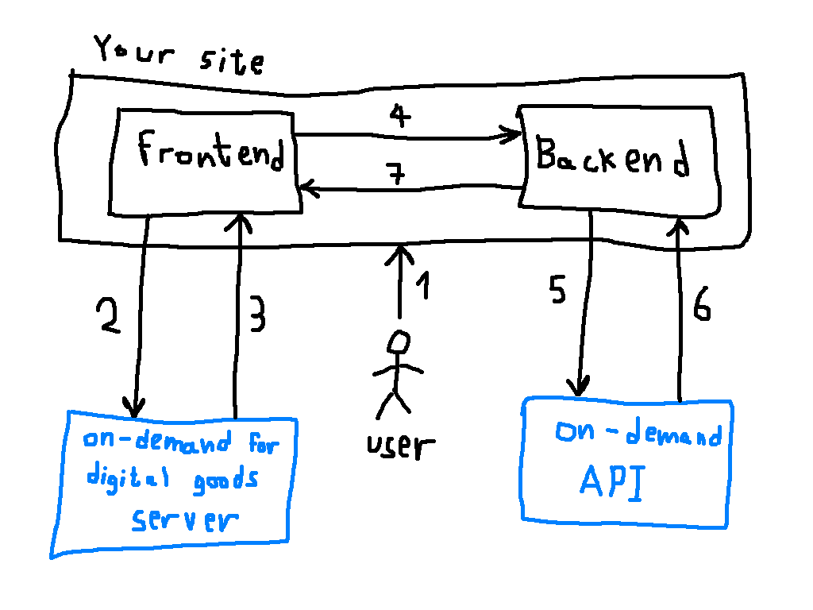
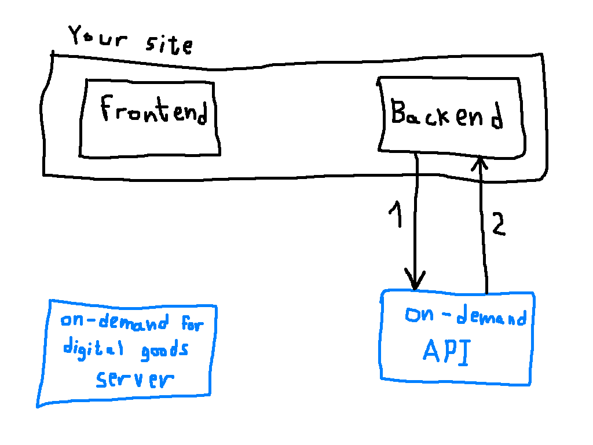

# Process Overview
The aim of this document is to give you a better understanding of how Klarna on-demand for digital good works. This will enhance your ability to integrate this offering into your site in the best way possible. It will also shed important light on the offering's security measures.

While it is extremely easy to integrate Klarna on-demand for digital goods into your site, it is important to realize that it will only get you so far. While Klarna on-demand for digital goods greatly improves your users' buying experience, it cannot charge the users directly. A complete solution will typically consist of your site's frontend and backend, Klarna on-demand for digital goods and [Klarna's on-demand API](http://docs.inapp.apiary.io/).

We will show how all these components interact in the following sections, where we present the different flows offered by Klarna on-demand for digital goods - one-time payments and recurring payments.

The main difference between one-time and recurring payments is that while one-time payments are about performing a singular, well defined, purchase (as the name implies), recurring payments allow the user to register for future payments that will be initiated solely at your own discretion.

## One-time payment
Consider the following diagram which depicts the flow of a typical one-time payment:

This diagram makes little sense were we not to go over each of the numbered interactions:

1. A user browses your site, where you've already integrated Klarna on-demand for digital goods (to see how this is accomplished, refer to the [integration guide](integration.md)). Seeing how your site offers something the user desires, he opts to buy it by filling our the form presented by the on-demand SDK, which clearly states the cost of the purchase.

  First time users will be asked to:
  1. Enter their phone number
  2. Verify it using an SMS code sent to them
  3. Enter their email
  4. Choose their preferred payment method (some methods will require additional details to be entered)

  The SDK handles all of the above for you.
2. When the user posts the form the SDK intercepts that action and sends the purchase details to the Klarna on-demand for digital goods server, where an origin proof corroborating the purchase is generated. The server also generates a token identifying the user who initiated the purchase.
3. The origin proof, user token, the email entered by the user and all of the form's hidden fields are sent back to the SDK.
4. The SDK passes the data along to your backend, as if the form had been posted normally.
5. The backend uses the data to post an order creation request to the [Klarna on-demand API](http://docs.inapp.apiary.io/#orders). The origin proof is part of that data and it allows the API to make sure that the request was originated by the user's action. It also assures the user that the order is not tampered with in any way, for example by presenting him with a certain cost while in fact issuing a purchase at a greater cost.
6. The API approves or declines the order and reports the result to the backend.
7. The backend updates the frontend according to whether or not the purchase was successful.

## Recurring payment
Recurring payments are comprised of two distinct steps, described below.

### Acquiring a recurring payment reference
This process is extremely similar to how a one-time payment is performed, and will yield a reference that can be used to charge a user at your convenience. The process is so similar, in fact, that we can use the same diagram:

Keep in mind, however, that each interaction now has a different meaning:

1. A user browses your site, where you've already integrated Klarna on-demand for digital goods. Seeing how your site offers something the user desires on a regular basis, he decides to register for recurring payments.

  First time users will be asked to:
  1. Enter their phone number
  2. Verify it using an SMS code sent to them
  3. Enter their email
  4. Choose their preferred payment method (some methods will require additional details to be entered)

  The SDK handles all of the above for you.
2. When the user posts the form the SDK intercepts that action and sends the registration details to the Klarna on-demand for digital goods server, where an origin proof is generated. This origin proof cannot be used for performing purchases directly. Instead, it is used for generating a recurring payment reference. The server also generates a token identifying the user who registered.
3. The origin proof, user token, the email entered by the user and all of the form's hidden fields are sent back to the SDK.
4. The SDK passes the data along to your backend, as if the form had been posted normally.
5. The backend uses the data to request a recurring payment reference from the [Klarna on-demand API](http://docs.inapp.apiary.io/#recurringpayments). The origin proof is used to make certain the request was originated by the user's action.
6. Barring any errors, the API sends a recurring payment reference to the backend.
7. The backend stores the recurring payment reference for future use and updates the frontend according to whether or not the process was successful.

### Using a recurring payment reference
There isn't much point in acquiring a recurring payment reference if you don't plan to use it for creating charges. Let us see how this process takes place:

This simple process is comprised of the following interactions:

1. At any given point, the backend decides to perform a purchase using a recurring payment reference it has previously stored. It sends all purchase information, along with the recurring payment reference to the [Klarna on-demand API](http://docs.inapp.apiary.io/#orders).

   **Note:** The recurring payment reference is supplied in place of the origin proof used when performing a one-time payment.
2. The API approves or declines the order and reports the result to the backend.

At this point, your backend may choose to update the user about the charge, by sending an email, for example.

## How safe is this?
Safe, very safe. To have a really good buying experience you and your users must be able to trust our solution. Here's what makes our offering safe:

* Origin proofs are required when performing any action that might be considered dangerous (placing an order or acquiring a recurring payment token). These tokens are virtually impossible to forge.
* All origin proofs are single-use only, which eliminates the threat of replay attacks.
* Even if a malicious third party gets a hold of an origin proof that is still valid, or of a recurring payment reference, they will still require your credentials to make successful calls. For this reason you must guard your application secret well (see the [integration guide](integration.md) if you need help getting a hold of credentials).

## Return customers
We've mentioned the term "first time users" in the above process flows, and this seems like the perfect opportunity to explain the notion of return customers.

Technically, when the Klarna on-demand for digital goods SDK displays a form on your website, it utilizes an iframe. Once a user fills his information in one of our forms for the first time the iframe retains a cookie with that information, so that upon return visits the user is identified instantaneously for an even smoother experience.

While great, this gets even better. Seeing how the iframe is, essentially, independent of your site, it's enough for the user to have interacted with a Klarna form on any *other* site for him to be treated as a return customer when navigating your own site. This all holds true as long as the user is using the same device and browser, of course.